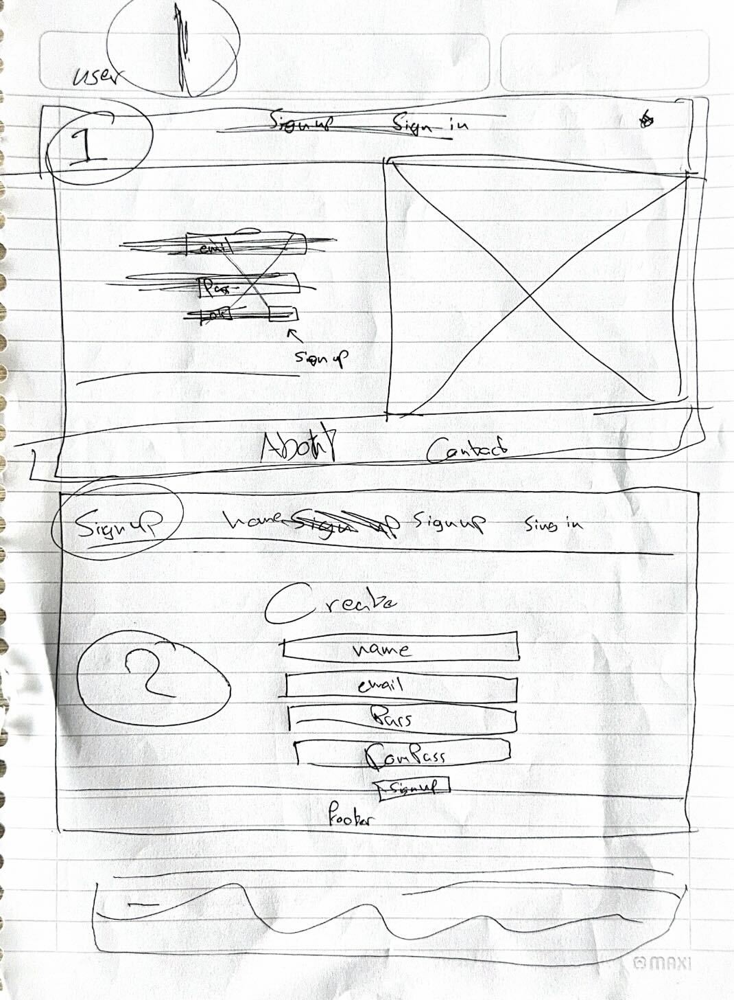
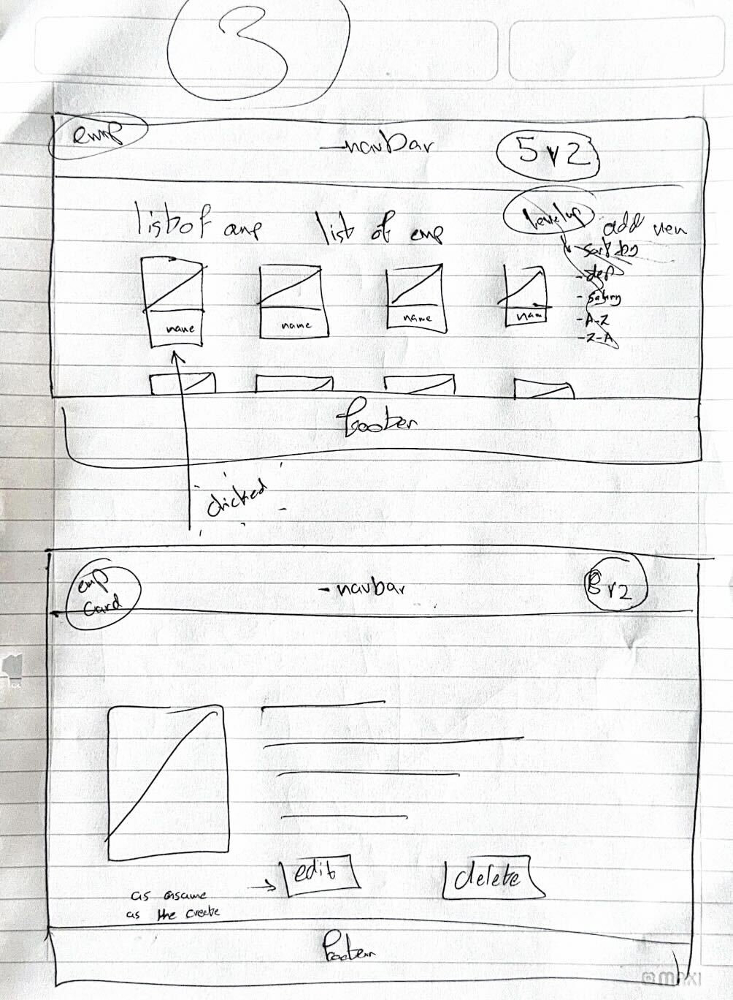
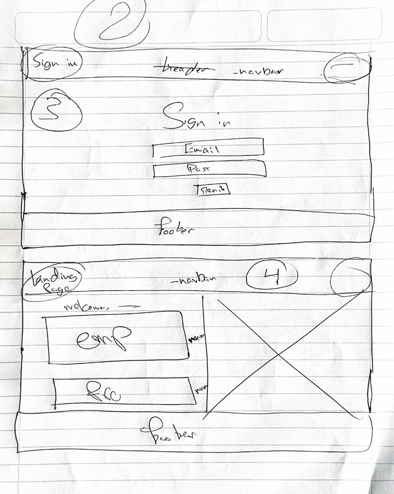
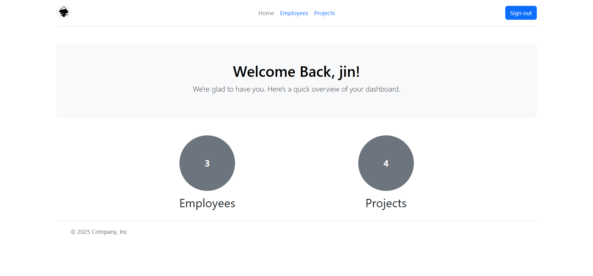
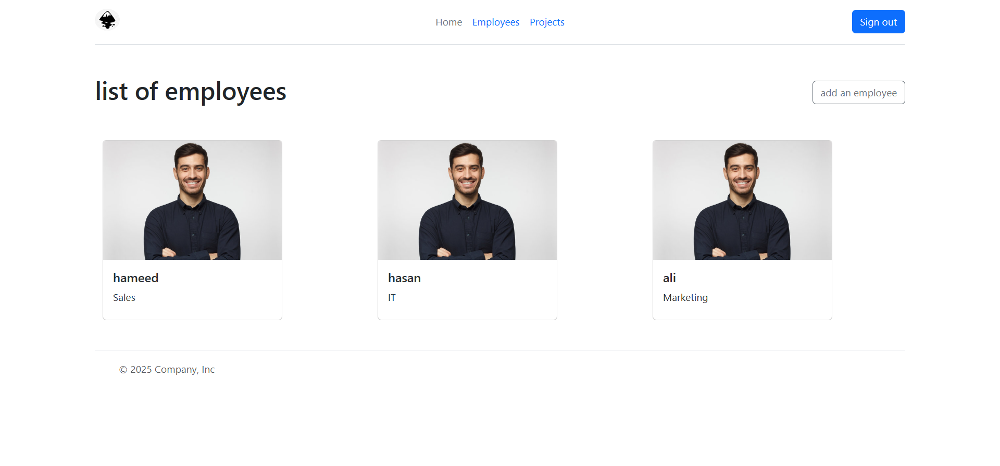
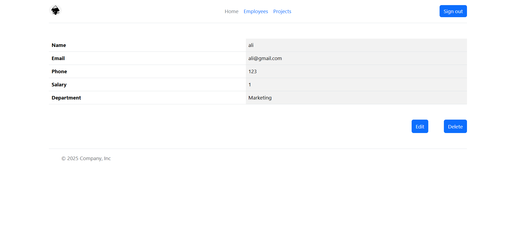
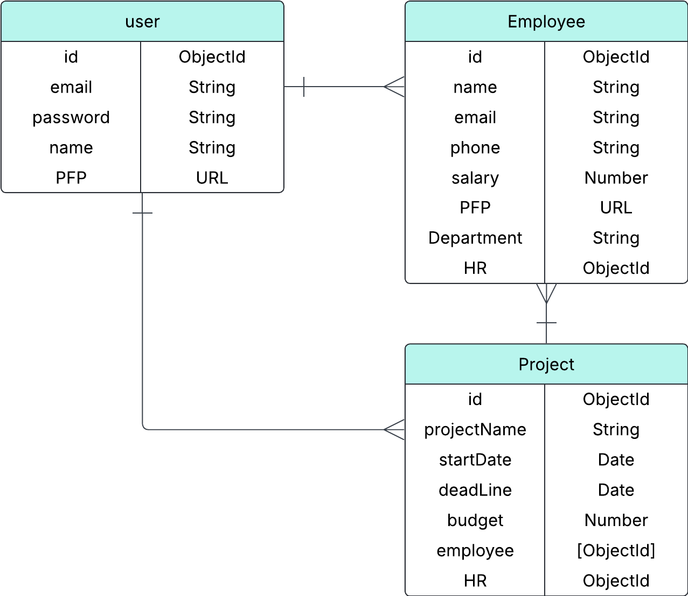

# HR Management System (Birch)

## Date: 7/17/2025

### By:

- Zeshan Ahmed
- Mahmood Abdulnabi
- Ali Alqassas

---

### **_Description_**

An app designed for human resources use, the goal of app is to provide the ability to add & manage employees & projects for their company.

---

### **_Technologies Used_**

- HTML
- CSS
- JavaScript
- ejs
- Mongo DB
- Boot Strap
---

### ***Getting Started***

#### Day 1. We started with an ERD diagram of the entity relationships, made wireframes of the website & how they would look, & added the necessary files. 
#### Day 2. We worked on the models, controllers, & routes of auth, & the employees. In adition, we made the database.
#### Day 3. We added the models, controllers, & routes of projects, & added it to the rest of the files where it was needed. In adition, we created all the ejs files.  
#### Day 4. We mainly wored on the CSS of the application using Boot Strap.
#### Day 5. We added multer to the code & fixed bugs. 

---

### **_Screenshots_**

### **_Wireframes screenshots:_**

### **_Some Application screenshots:_**

### **_ERD:_**

---

### **_Future Updates_**

- [ ] Adding a department section
- [ ] Adding a payroll section for employees
- [ ] adding an input validation
- [ ] Adding employee view pages
- [ ] enhance design

---

### **_Credits_**

##### For styling: [Boot Strap](https://getbootstrap.com/)
